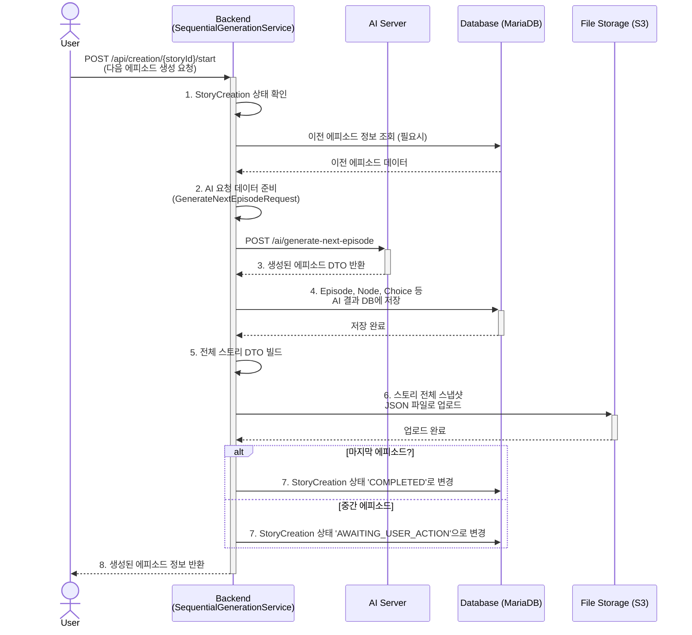
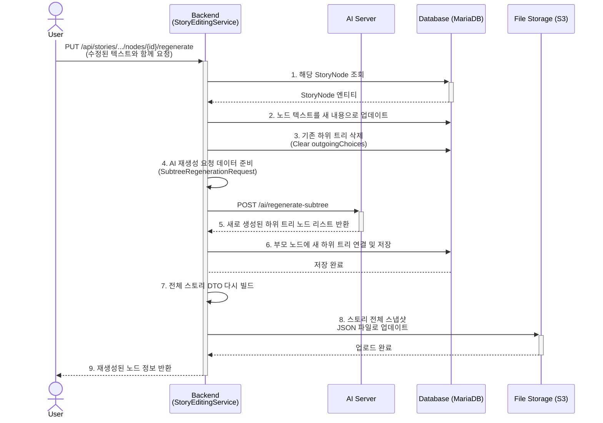

# 프로젝트 주요 플로우 다이어그램

이 문서는 `story-backend`의 주요 플로우를 Mermaid.js를 사용한 다이어그램으로 시각화합니다.
이 다이어그램은 Mermaid.js를 지원하는 마크다운 뷰어(예: GitHub, GitLab, Notion)에서 그림으로 렌더링됩니다.

## 1. 스토리 생성 플로우 (Episode-by-Episode)

`SequentialGenerationService`를 중심으로 AI와 협력하여 에피소드 단위로 스토리를 생성하는 과정입니다.



## 2. 게임 플레이 플로우

`GameService`가 사용자의 선택을 받아 스토리를 진행시키고, 각종 상태(게이지, 태그)를 관리하는 과정입니다.

```mermaid
graph TD
    subgraph "게임 시작"
        A[User: POST /api/game/{id}/start] --> B{GameService: startGame};
        B --> C[1. GameSession 생성 및 초기화];
        C --> D[2. AI Server에 이미지 생성 요청<br>POST /ai/generate-image];
        D --> E[3. 첫 노드 정보와 이미지<br>GameStateResponseDto로 반환];
    end

    subgraph "게임 진행 루프"
        F[User: POST /api/game/session/{id}/choice] --> G{GameService: makeChoice};
        G --> H[1. 선택지에 따라<br>다음 노드로 상태 전이];
        H --> I[2. 선택지 태그 누적<br>(accumulatedTags)];
        I --> J[3. RAG AI에 게임 진행 상황 업데이트];
        J --> K{4. 다음 노드가 엔딩인가?};
        
        K -- No --> L[5. AI Server에 새 노드 이미지 생성<br>POST /ai/generate-image];
        L --> M[6. 다음 노드 정보와 이미지<br>GameStateResponseDto로 반환];
        M --> F;

        K -- Yes --> N{GameService: handleEpisodeEnd};
    end
    
    subgraph "에피소드/게임 종료"
        N --> O[1. 태그(tags)를 평가하여<br>에피소드 엔딩 결정];
        O --> P[2. 엔딩에 따라 게이지(gauge) 변경];
        P --> Q{3. 마지막 에피소드인가?};

        Q -- No --> R[4. 다음 에피소드 첫 노드로<br>세션 상태 변경 및 태그 초기화];
        R --> L;

        Q -- Yes --> S{GameService: handleGameEnd};
        S --> T[5. 게이지(gauge)를 평가하여<br>최종 엔딩 결정];
        T --> U[6. GameSession 'isCompleted'로<br>표시하고 최종 엔딩 정보 반환];
    end
```

## 3. 대화형 스토리 편집 및 재생성 플로우

`StoryEditingService`를 통해 사용자가 수정한 노드를 기점으로 하위 스토리를 AI를 통해 다시 생성하는 과정입니다.


